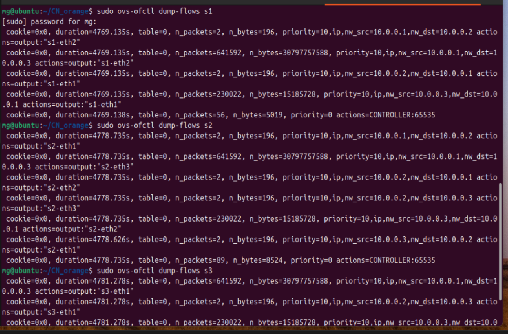
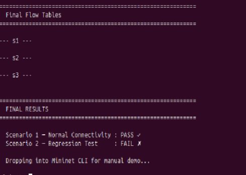
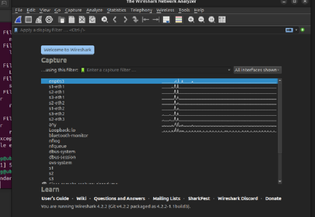

# Static Routing using SDN Controller

## Problem Statement
Implement static routing paths using a POX OpenFlow controller that installs pre-defined flow rules on OVS switches in Mininet. All forwarding is hardcoded — no dynamic learning.

---

## Topology
```
h1 (10.0.0.1) --- s1 --- s2 --- s3 --- h3 (10.0.0.3)
                           |
                      h2 (10.0.0.2)
```

| Switch | Port 1 | Port 2 | Port 3 |
|--------|--------|--------|--------|
| s1     | h1     | s2     | —      |
| s2     | h2     | s1     | s3     |
| s3     | h3     | s2     | —      |

---

## Files
| File | Description |
|------|-------------|
| `static_routing_topo.py` | Mininet topology script |
| `static_routing.py` | POX controller with static flow rules (goes in ~/pox/ext/) |
| `regression_test.py` | Automated validation + regression tests |

---

## Setup & Execution

### Prerequisites
```bash
sudo apt install mininet git
git clone https://github.com/noxrepo/pox ~/pox
```

### Step 1 — Copy controller into POX
```bash
cp static_routing.py ~/pox/ext/
```

### Step 2 — Start POX Controller
```bash
cd ~/pox
python3 pox.py static_routing --verbose
```

### Step 3 — Start Mininet (new terminal)
```bash
sudo python3 static_routing_topo.py
```

### Step 4 — Test in Mininet CLI
```
mininet> pingall
mininet> h1 ping h3 -c 5
mininet> iperf h1 h3
```

### Step 5 — Inspect Flow Tables
```bash
sudo ovs-ofctl dump-flows s1
sudo ovs-ofctl dump-flows s2
sudo ovs-ofctl dump-flows s3
```

### Step 6 — Run Regression Test
```bash
sudo python3 regression_test.py
```

---

## Expected Output

**pingall**
```
h1 -> h2 h3
h2 -> h1 h3
h3 -> h1 h2
*** Results: 0% dropped (6/6 received)
```

**Flow table s2**
```
priority=10,ip,nw_src=10.0.0.1,nw_dst=10.0.0.3 actions=output:3
priority=10,ip,nw_src=10.0.0.2,nw_dst=10.0.0.1 actions=output:2
...
priority=0 actions=CONTROLLER:65535
```

---

## Test Scenarios
- **Scenario 1** — Normal connectivity: `pingall` shows 0% packet loss
- **Scenario 2** — Regression: rules deleted → connectivity breaks → controller reinstalls → path verified identical

---

## References
- [POX Wiki](https://noxrepo.github.io/pox-doc/html/)
- [OpenFlow 1.0 Spec](https://opennetworking.org/wp-content/uploads/2013/04/openflow-spec-v1.0.0.pdf)
- [Mininet Walkthrough](http://mininet.org/walkthrough/)

## Proof of Execution

### pingall — 0% packet loss


### Flow table — s2


### Regression test results


### Wireshark capture (ICMP + OpenFlow)
